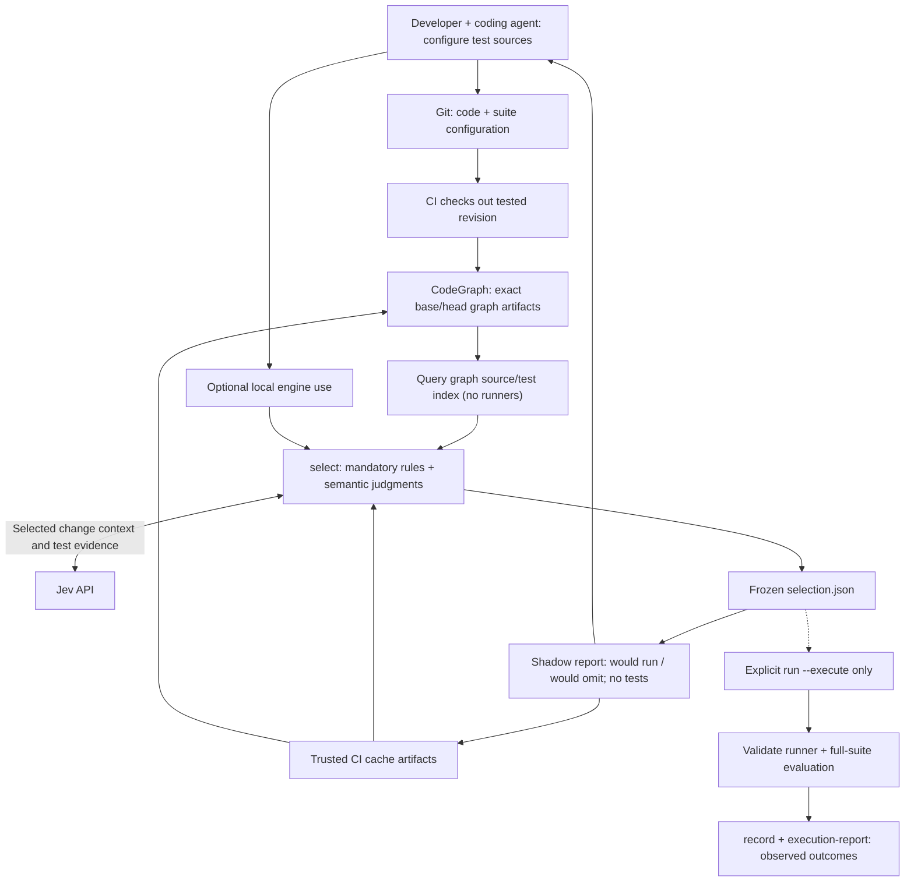

# Faultline implementation and validation plan

## Goal and architecture

Build a language-agnostic test impact analysis engine for CI and coding agents. Combine deterministic positive impact evidence with Jev relevance judgments to reduce CI work while preserving observed regression detection. Semantic relevance, regression recall, and measured code coverage are separate metrics. No policy guarantees preservation of all coverage.

The Python engine owns discovery validation, scoring, selection, caching, execution, and reporting. CodeGraph 1.6.0 owns structural parsing/resolution and its embedded SQLite graph. Faultline snapshots both base and head, reuses immutable artifacts, and joins reverse file relationships to provisional targets from configured source paths. Analysis never invokes native runners by default; native enrichment is explicit, and mandatory runner validation occurs only for the suite being executed. Existing coverage tooling is optional positive enrichment; do not build a language parser stack. The skill supports setup, baseline sharing, local use, and explanations. CI requires the engine and test environment, not a coding-agent session.

Git shares `faultline.json`. The graph database is the primary source/test index; namespaced source and target tables sit beside CodeGraph's structural tables. `init --baseline <ref>` builds a revision index once. Immutable artifact export/import shares baselines across checkouts, and compatible ancestors seed separate branch snapshots. Credentials, indexes, predictions, caches, and reports stay in ignored `.faultline/`. The current workflow neither reads nor maintains the earlier description catalog; its commands remain only for older explicit workflows.

## Flow and integrations

`init --baseline`, `graph build/inspect/import/export`, `discover`, `select`, `run`, `record`, `shadow-report`, and optional `mapping import-phpunit` are implemented with report-only shadow defaults. `select` saves proposal reports immediately; `shadow-report` tracks PR snapshots. `run --execute`, `record`, and `execution-report` are separate opt-in execution/evaluation commands. Existing CI artifact tooling transports immutable graph and Jev caches; producer authentication remains a CI responsibility. Existing `rank`, `evaluate`, and `report` retain their legacy ranking contracts.

Git/hosting tooling supplies cumulative PR/MR changes, tested revisions, and outcome artifacts. CI retains containers, services, isolation, matrices, and scheduling. Faultline does not replace hosting platforms or the CI scheduler.

## Stage 1 — Primary graph index and native runner contracts

The graph source/target index supersedes the original shared-description catalog in the current workflow. Baselines are immutable and portable; stable repository identity and revision/configuration keys separate checkouts and branches. Legacy catalog contracts listed below are retained only for existing data.

Implemented:

- Primary graph index: CodeGraph structural tables plus source and configured target records, including unsupported languages and empty suite diagnostics. No catalog reads or review stage in the current flow.
- `init --baseline`, immutable per-revision publication, nearest compatible ancestor reuse, and portable artifact import/export. Separate branches and checkouts cannot mutate a shared baseline.
- Stable repository identity independent of checkout directory names. Import validates artifact integrity and source identities against the local revision; trusted storage supplies producer authentication.
- `discover` queries indexed targets; explicit `--native` enrichment remains optional. Whole checks use `kind: "check"` and need no individual test inventory.
- Native PHPUnit 9.6 and Behat 3.29 inventory/result contracts preserve datasets, scenarios/outlines, and matrix variants. Generic JSON contracts support other runners. Runtime identity is validated only for explicit execution.
- Optional `mapping import-phpunit` imports positive test-attributed coverage relationships; no custom PHP parser or coverage instrumentation. Missing relationships never establish irrelevance.

Validation completed: real CodeGraph 1.6.0 indexing and incremental reuse; source additions/renames/removals; Gherkin records without structural nodes; cross-checkout import/cache hits; branch isolation; simultaneous publication; wrong-repository, configuration, and integrity rejection. Existing synthetic runner and coverage tests remain in place.

Remaining acceptance: validate a real suite at a chosen PR revision, verify native identities against execution/results, measure indexing effort, and qualify remote-process coverage before using it. Behat HTTP coverage requires evidence from the application-serving process; local CLI coverage is insufficient. Extend runner-version support through conformance fixtures. Legacy description catalog commands remain solely for older explicit workflows.

## Stage 2 — CodeGraph selection engine and shadow reporting

The implemented report-only policy now scores all readable configured targets directly from Git, including Gherkin and JavaScript/TypeScript, by querying the primary graph index. Graph failures retain an explicitly labeled Git fallback. No reviewed description, native runner, or structural path is required. Whole inputs are preserved when they fit; adaptive evidence windows and bounded test cohorts complete targets before advancing. Preparation estimates work without Jev calls, and request-limited invocations resume exact cached batches. Incomplete judgments remain would-run. TLS errors identify certificate trust failures explicitly. This deliberately changes shadow proposals only: the stricter requirements below still apply before enabling selective execution.

Implemented shadow path: exact Git source export into isolated snapshots; pinned producer/schema validation; portable closed SQLite artifacts; compatible incremental reuse; base/head reverse dependency evidence; visible source-gap and traversal-limit warnings without blocking Jev; graph-context Jev batching and immutable answer caches; automatic would-run reports and PR snapshot tracking without execution; separately opted-in execution receipts and JUnit/generic outcome recording.

Validated with offline contract tests and the actual CodeGraph 1.6.0 executable on synthetic PHP dependencies. Live Jev evaluation and real CI recall remain unverified. See [the working workflow](skills/faultline/references/graph-workflow.md).

The requirements below span the implemented shadow path and future selective execution. Exact filtering, trusted suspension state, automatic audits, broader native runner versions, and production CI trust configuration are not enabled by this stage.

- Normalize the cumulative PR/MR diff and exact tested snapshot, including synthetic merge revisions. Freeze base/head, configuration/index/policy versions, evidence hashes, selected/omitted units, reasons, fallbacks, prerequisites, timings, and usage in immutable `selection.json`.
- Expose `select`, `run --selection … --suite …`, and `record`. Reject revision/configuration/index mismatches before execution. Validate native identities only for the requested suite at execution; inventory disagreement or failure requires full execution and an incomplete assessment. Preserve runner exit status. Never interpret missing, empty, invalid, or interrupted decisions as permission to run zero tests.
- Mandatory execution includes changed/new tests, must-run rules, positive dependency/coverage matches, relevant setup changes, unresolved failures, and uncertain units. Missing relationships are not negative evidence. Bound unknown changes by explicit scope; unbounded unknowns execute every suite.
- Use native filtering at file/class granularity, including all associated datasets, scenarios, and variants. Validate exact selectors against discovery; unsupported filters or unresolved prerequisites widen execution. CI supplies services, containers, and scheduling.
- Default to shadow mode: freeze the proposal and save would-run reports; do not execute tests or change CI. Full-suite evaluation requires an explicit execution request and `run --execute`. Reviewed experimental opt-in may omit only complete/current units with `P(irrelevant) >= 0.95`. This is an experimental threshold, not a calibrated safety guarantee.
- On missing credentials, Jev errors, invalid responses/selectors, insufficient evidence, expired/unavailable trusted state, or exhausted budgets, execute the affected suite fully and record why.
- Retain the five-level evaluator (`irrelevant`, `weak`, `plausible`, `strong`, `direct`), probabilities, expected 0–4 score, deterministic identity tie-breaks, and pinned model/evaluator versions. Benchmark evaluator changes separately.
- The official multi-question HTTP contract is verified; validate live model behavior and batch several judgments against shared change context. Bound batch bytes/units, requests including retries, and elapsed time; validate each answer independently. Keep existing serial pacing, bounded retry/backoff, interruption recovery, and credential-safe errors.
- Cache actual complete inference inputs: selected change text, test evidence, full batch context, question/schema, and model/evaluator versions. PR numbers, timestamps, and run metadata are provenance outside inference identity. Similar descriptions do not justify reuse across changed inputs.
- Share immutable caches using existing CI artifacts. Only trusted jobs publish reusable evidence; PR jobs cannot overwrite trusted caches. Missing artifacts are cache misses. Integrity hashes detect modification, not malicious producers; enforce producer trust outside those hashes.
- Keep `TYPESAFE_API_KEY` resolution from environment, `.faultline/.env`, then root `.env`. No credentials in evidence; read them only for live evaluation. No embeddings, lexical top-K exclusion, vector database, or hosted service initially.

**Milestone 1:** inspectable indexing and cached ranking of a real cumulative change, with reproducible native identities, shared descriptions, frozen decisions, visible fallbacks, and verified execution behavior. A second checkout reuses descriptions, compatible graph artifacts, and identical inference inputs without repeated full indexing or calls.

## Next experiment — Broad Jev scoring with focused graph evidence

This is proposed work, separate from the implemented adaptive batching above. Optimize the evidence sent per target before reducing eligibility. Graph searches supply positive impact evidence, useful source context, and evaluation priority. A missing path, graph traversal limit, unsupported language, or low retrieval rank must never exclude a test from semantic assessment. Prefer a broad set of candidates over silent graph-based omissions.

1. **Separate decisions already required from semantic choices.** Changed tests, explicit must-run rules, setup requirements, and verified positive coverage relationships remain required. Record them without paying for a Jev judgment that cannot change selection, unless a separately budgeted comparison needs it. The current policy treats every structural path as mandatory; evaluate distinguishing resolved symbol relationships from broad file-level or heuristic hints. Jev may narrow the latter in shadow proposals. Define and benchmark that distinction before changing execution policy.
2. **Improve graph evidence precision without narrowing eligibility.** Locate changed symbols from both sides of diff hunks where CodeGraph provides spans; preserve actual edge kinds, provenance, and paths to test sources. Include declarations, shared setup, and unknown effects explicitly. Use broad file relationships as additional context where symbol mapping is unavailable. Symbol precision must not become a graph-only filter.
3. **Reuse compact evidence from the primary index.** Derive source-backed test names, behavior text where present, relevant symbols, setup, and short source excerpts. Keep source locations, hashes, omissions, and extraction provenance. Update affected records incrementally and share them with graph baselines; do not revive a separately maintained catalog or generate summaries per developer or PR. Unsupported structural languages still contribute their readable source. Jev supplies bounded judgments, not generated descriptions.
4. **Score broadly, inspect further selectively.** Send the cumulative change context once per bounded batch and ask one relevance question per unique behavior/context. Include tests with no graph path. Group related evidence to limit unrelated context; expand results to execution variants only when their behavior and relevant context are identical. Fetch fuller source for uncertain assessments and omission candidates whose compact evidence is insufficient. Summaries and high model confidence alone do not establish evidence completeness. Keep unresolved or budget-limited targets visibly unknown and would-run.
5. **Measure before adopting two-stage scoring.** Compare the current full-source approach, compact single-pass Jev, and compact-then-deeper assessment on the same frozen changes and later outcomes. Two passes may cost more if most targets require expansion. Report unique behaviors versus variants, evidence bytes and provider tokens, requests, latency, completed assessments, mandatory targets, and incremental detections outside graph matches. Keep model/evidence/policy versions and full transmitted context in cache identities. Tune on different cases from assessment; proposed omission counts are not measured savings or recall.

Do not use a graph-only shortlist, lexical top-K, module-level negative verdict, or random audit as justification to declare unseen tests irrelevant. Do not treat `P(irrelevant) >= 0.95` as a coverage guarantee. Increasing concurrency or the request cap can improve throughput but does not remove repeated evidence or establish selection quality. Keep shadow mode report-only and existing CI execution unchanged while comparing these alternatives.

The design follows Jev's [shared-state fan-out](https://docs.typesafe.ai/patterns/fan-out) and its documented [limits around indirection and unrelated context](https://docs.typesafe.ai/model-jaggedness/jev-1.13). Context limits are ceilings, not target batch sizes. Maintain bounded transport and make incomplete assessments explicit.

## Stage 3 — Prospective shadow pilot

Next validation: run the complete graph-backed workflow on a representative PR/MR, using its actual diff base and tested head. Audit graph relationships against native inventory, including custom PHP extensions, YAML service wiring, Gherkin steps, and remote boundaries. Keep outcomes hidden until proposals are frozen. Validate Linux artifact reuse, indexing resources, and graph-only versus hybrid evidence before considering selective execution.

Shadow reports track frozen proposals across PR snapshots and make no outcome-based claims. Separate execution reports group retries and suites by compatible change snapshot, retain exact observations, and publish denominators and descriptive uncertainty. Baselines currently compare equal execution-unit counts; equal-runtime budgets, setup/job savings, audit costs, and externally incurred agent costs need further measurement.

- Start with one ordinary PR/MR. Keep existing CI test jobs unchanged; do not scan a hundred PRs or trigger historical reruns by default. Resolve exact tested revisions/attempts with bounded, cached hosting calls.
- Freeze decisions before outcomes exist. Collect green runs, regressions, flakes, infrastructure failures, and incomplete/expired runs. Passing retries are not automatically flakes; CI downtime is not a product regression.
- Use the existing test runner's result/coverage producers. Qualify coverage-driver overhead and remote application attribution separately. Importer provenance must include source revision, runner variant, scope, and collection completeness.
- Match outcome identities exactly. A known failure missing from the catalog excludes the corresponding recall claim. Unexecuted tests are unknown, never passing. Current-catalog retrospective cases disclose suite drift; retain each exact index snapshot.
- Compare full execution, deterministic dependency/path rules, lexical selection, Jev, and the hybrid at equal execution budgets or observed recall. Preserve existing seeded-random and verified historical-order ranking baselines. Keep tuning cases apart from later assessment cases.
- Produce Markdown and JSON reports after a single case; subsequent cases accumulate without repeated downloads/inference. Publish denominators, exclusions, and uncertainty. Repeated attempts are not independent regression cases.
- Failing-change recall measures whether any regression is detected in a change. Failing-test recall measures the fraction of known failing tests included. Coverage is reported only from instrumentation. Savings subtract selection, setup, and audit overhead from avoided execution.
- Report Jev usage, description/indexing effort, selection latency, execution minutes, jobs/setup avoided, and audit overhead separately. Use dated configurable pricing; external agent costs remain unknown unless supplied. Serial duration sums are estimates, not parallel CI wall-clock measurements.
- Aggregate compatible policies across ordinary index evolution while preserving per-case evidence. Investigate misses after freezing and evaluating; do not rewrite evidence or retroactively tune the original prediction.

**Milestone 2:** reproducible evaluation of real cases with baselines, traceable classifications, reports, and limitations. One PR should yield an understandable report; a second case should join the aggregate without repeating unchanged work. A green run cannot establish regression recall or safe omission.

## Stage 4 — Experimental selection

- Require per-suite reviewed configuration and explicit maintainer opt-in. No automatic promotion, including when evidence remains limited.
- Preserve full post-merge runs and a deterministic, outcome-independent 10% sample of PR snapshots. Include audit cost in savings.
- An observed missed regression suspends that suite's selection through trusted CI state until reviewed. Missing suspension state means full execution. Post-merge detection does not establish pre-merge safety.
- Validate setup dependencies, exact selectors, additions/removals, stale evidence, failure-state persistence, budgets, credentials, cache trust, and interruptions. Every incomplete decision must produce a visible full-execution fallback.

## Stage 5 — Extension and distribution

Publish versioned CLI/plugin releases, native conformance fixtures, and extension contracts. Add Playwright through the same contract; browser-only coverage does not imply backend coverage. Qualify existing producers before writing new instrumentation. Agent installations and CI use the same Python implementation; scripts and references remain self-contained inside the skill.

Keep local agent support alongside CI validation. Consider additional runner versions, native dependency/coverage producers, and better cost models after measuring the initial pipeline. Embeddings, hosted services, retrieval exclusions, and alternative evaluators remain deferred experiments with independent benchmarks.

## Existing ranking and historical contracts to preserve

The legacy engine and skill already implement the following. Their offline tests remain regressions for the shared-engine work; they do not establish that the new selection pipeline is complete.

### Existing Jev ranking — Fixed Jev evaluation and reproducible ranking

Implemented:

- The ranking workflow gathers cumulative PR/MR context and the actual tested revision. Revision IDs are provenance, not a standalone commit-ranking UX.
- Versioned evaluator `relevance-v1`, using a fixed Choice question and five definitions: irrelevant, weak, plausible, strong, direct. Initial model: `jev-1.13.0`, configurable only as a pinned version.
- Probability validation, expected relevance scoring with values 0–4, and deterministic test-ID tie-breaking. The agent never modifies scores or order.
- `rank` / `jev-evaluate` accept structured change/catalog files, expose a network-free dry run, cache each test judgment, and save full probabilities plus a readable ranking. Cache identity includes relevant change input, snapshot, profile, question/schema, and model configuration.
- Complete predictions are frozen with an integrity hash and full source inputs. Partial attempts remain inspectable and resume from completed pair predictions. Integrity checks detect accidental edits, not dishonest agent attestations.
- Jev transport uses serial paced calls, an explicit request ceiling including retries, bounded backoff for rate limiting/overload, persisted cooldowns, and no automatic retry of ambiguous connection failures. Oversized context is rejected rather than silently truncated. Credentials come from the environment or local `.env` files, are loaded only for live evaluation, and never enter saved evidence.

Acceptance: inspect rankings for several real changes; verify unrelated tests score low and relevant cross-behavior tests appear high. Live service access and ranking quality remain unverified. Offline tests exercise the HTTP contract, invalid probabilities, interruption/reuse, request limits, model versions, and credential-safe errors.

**Legacy ranking milestone:** an installable self-contained skill, inspectable incremental catalogs, one-change semantic ranking, probability evidence, deterministic order, and local caches. Code and skill packaging are implemented; real-change validation is the next experiment.

### Existing historical collection — Historical evidence without hindsight

Implemented as skill workflow and structured contracts:

1. Select a PR/MR and snapshots independently of failures. Read only outcome-blind intent/diff and run identity/revision metadata.
2. Build/freeze each complete prediction before reading conclusions, artifacts, debugging comments, or test outcomes.
3. Retrieve existing results through the agent's available tools, without triggering workflows. Preserve run IDs, attempts, tested snapshots, collection completeness, and evidence locations.
4. Normalize outcomes into the generic schema. Require explicit test identities and evidence for non-unknown failure labels. Keep ambiguous matching and missing tests visible.
5. Classify confirmed regressions, likely flakes, infrastructure, baseline, and unknowns. Do not equate a red workflow with a regression or a passing retry with proof of flakiness.

Historical context must match the tested snapshot, including synthetic merge revisions when applicable. Omit edited PR text if its pre-outcome form is unavailable. Do not substitute a final fixed diff. A current test index is explicitly exploratory because of suite drift.

The script validates declared outcome-blind provenance and requires an outcome-collection timestamp after the completed prediction. It cannot independently prove what an agent has seen. A contaminated agent context must not claim blindness; use a genuinely fresh allowed context or disclose that the experiment is invalid.

Hosting calls are the agent's responsibility: serial authenticated requests, local reuse, explicit refresh, a finite collection budget (default 100 calls), pagination accounting, and honoring provider backoff/reset instructions. Jev's request ceiling is independently enforced by code.

Acceptance: one real PR/MR with multiple commits and attempts produces separate applicable predictions and traceable outcome records. Missing/expired artifacts, CI downtime, and incorrect revision mappings remain exclusions or limitations, not false successes.

### Existing evaluation — Evaluation and reports in the same interaction

Implemented:

- An agent request to analyze one PR/MR runs the complete skill workflow. Users need not manually invoke indexing, ranking, comparison, and report commands.
- `evaluate` compares a complete frozen prediction with subsequently collected outcomes and automatically saves `findings.json`, `report.json`, and `report.md`. Updating classifications recalculates measurements without repeating unchanged Jev calls.
- Baselines use identical catalogs: lexical cosine similarity over words, shared-path proximity, deterministic seeded random order, and verified historical execution order when available.
- Metrics distinguish hit rate from failing-test recall at 1, 5, 10, 20, 50, plus first-failure positions. A confirmed failure missing from the catalog excludes that run's metrics to avoid optimistic recall.
- Time to Semantic Failure is a serial duration sum, available only with every needed duration. Queueing and infrastructure downtime are excluded. Parallel/unknown scheduling is not presented as observed wall-clock improvement.
- Per-case reports expose coverage, classifications, exclusions, complete rankings, and worst misses. Green/unknown-only evidence says regression-detection performance cannot be assessed.
- Offline `report --prediction` regenerates a case report. Unscoped `report` aggregates saved evidence, counting one earliest eligible case per PR/MR and separating repositories/evaluator configurations/index hashes/random seeds. Repeated attempts do not increase denominators. Recall is macro-averaged; p90 is omitted below ten cases.
- The agent adds evidence-based narrative and investigates misses without changing the authoritative JSON measurements. Improvements after inspecting outcomes belong to a new experiment, preserving the original frozen result.

Acceptance: a real single-PR request ends with an understandable case report and its evidence; a second case joins the aggregate without repeated downloads or inference. Offline tests cover this pipeline and report generation, including no eligible regressions, reruns, wrong revisions, missing durations, multiple PRs, and evaluator separation.

**Legacy evaluation milestone:** reproducible historical evaluation with evidence-based labels, baselines, and local reports. The deterministic pipeline is implemented and tested with synthetic fixtures. Real-history usefulness remains to be established.
