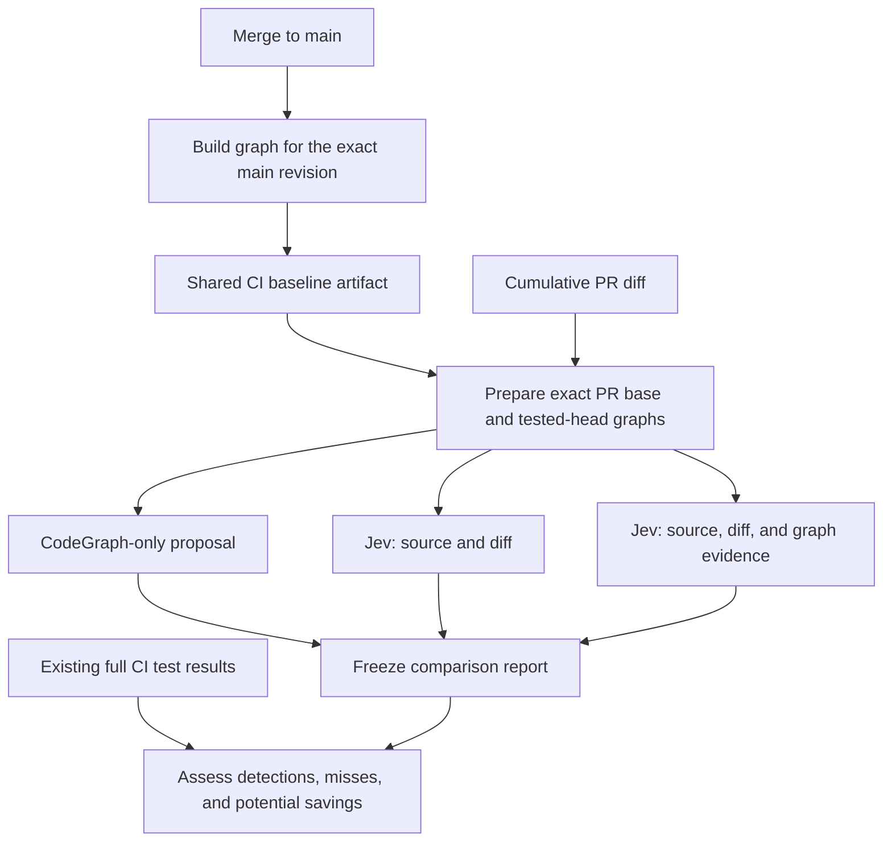

# Faultline

Faultline explores whether CodeGraph and Jev can help a team choose the right tests for a code change. It is a test impact analysis tool for repositories with different languages and test frameworks.

The first goal is to measure the value of those decisions. Faultline produces shadow reports while your existing CI continues to run its full test suites. Once we have a useful reference, we can test whether faster or cheaper approaches preserve its results.

## How CodeGraph and Jev work together

CodeGraph builds a local index of source files, symbols, and relationships. Faultline stores configured test targets in that same graph database. Graph searches supply positive impact evidence and context for a change. A test with no discovered path remains eligible for semantic assessment.

Jev evaluates how the change relates to the behavior in each test. It receives the diff, test source, configured setup source, and, in the combined approach, graph evidence. Faultline retains the relevance probabilities and applies explicit selection rules. These probabilities describe relevance; they do not predict a test's failure rate or prove that skipping it preserves coverage.

The reference benchmark compares three approaches on the same revision and test inventory:

| Approach | Evidence | What we want to learn |
| --- | --- | --- |
| CodeGraph | Structural relationships and shared mandatory rules | What local impact analysis suggests |
| Jev | Change context, test source, and configured setup | Whether semantic assessment finds useful relationships |
| CodeGraph + Jev | The same inputs with graph evidence | Whether structural context improves Jev's decisions |

Both Jev approaches assess every readable test target, including changed tests and tests without graph paths. Mandatory rules still apply to their proposed selections. Broad graph hints remain evidence for the combined model to judge, so the comparison can reveal additions and removals.

## From main to a pull request

A CI job can build a fresh CodeGraph baseline whenever a change reaches `main` and publish it as an artifact identified by its exact revision. Developers and PR jobs can use that artifact without rebuilding the same revision locally.

Each PR analysis uses its actual diff base and tested head. Those may differ from the latest `main`. Faultline validates supplied graph artifacts and builds missing revision graphs. Both sides matter: the base retains removed relationships, while the head includes new code and tests. Graph artifacts remain separate from Git source and never need to be committed.



The reference workflow uses fresh graphs for missing revisions. Incremental indexing remains available for ordinary analysis and can be compared with fresh builds later. CI owns artifact distribution, test environments, and scheduling. A coding agent can run the same Python engine locally.

## What the report tells you

The report shows which targets each approach would run, their disagreements, and any unresolved assessments. CodeGraph's positive matches are separated from mandatory rules and fallbacks. A target it does not suggest is not established to be irrelevant.

After the proposals are frozen, import existing CI outcomes to compare confirmed regressions caught or missed by each policy. The assessment includes failing-change recall, failing-test recall, and diagnostic rankings at equal target counts. It keeps flakes, infrastructure failures, unknown failures, and incomplete runs visible. A green run has no regression denominator, and repeated CI attempts are not independent cases.

Whole supplied diffs and test files stay intact in the default reference benchmark. Inputs that exceed the configured Jev limits remain unassessed. The report exposes those gaps instead of claiming that a shortened input represents the whole test. Preparation reports these blockers and exits with an incomplete status before inference. The explicit `file-pairs` mode compares whole test files with bounded groups of complete changed-file sections. It supplies setup identities rather than entire setup implementations and uses a separate experiment contract. Its scores describe the supplied windows; they can miss interactions across windows or through setup. Both Jev approaches share one request ceiling and inference deadline. Partial assessments remain proposed to run and do not qualify for comparative recall claims.

Test-duration sums estimate potential serial work avoided. They do not measure parallel CI savings. Measured coverage requires separate instrumentation. Token usage and analysis time are recorded, but neither takes priority over establishing useful test-selection behavior.

## Install and try it

Faultline ships as a self-contained Agent Skill and as a Python CLI. Codex and Claude Code plugin manifests are included.

```bash
npx skills add git@github.com:ronaldtebrake/faultline.git --skill faultline
```

Follow the [installation guide](docs/install.md), then ask your agent:

> Use Faultline to benchmark this PR with CodeGraph, Jev, and CodeGraph plus Jev. Prepare the graphs and show the estimated work before inference. Keep the total Jev requests within the agreed budget. Save the comparison report without executing tests or changing CI.

The [benchmark guide](skills/faultline/references/benchmark.md) covers the commands, outcome format, and main-branch baseline job. Python 3.10+ runs the engine. Structural indexing requires CodeGraph 1.6.0. The graph-only report requires no Jev credential; semantic assessment reads `TYPESAFE_API_KEY` from the environment or a local `.env` file as described in the setup guide.

New Jev cache entries use one `.faultline/jev-cache.sqlite` file. A benchmark stores its inputs and decisions in one frozen JSON file with a Markdown report beside it. Generated evidence and credentials remain in ignored `.faultline/`. Benchmark JSON contains source evidence and should stay within your repository's access controls.

## Status

The reference benchmark, fresh graph artifacts, CodeGraph-only reports, and offline CI-outcome assessment are implemented and covered by synthetic tests. Live Jev quality, real-project regression recall, and CI savings still need measurement.

Shadow analysis executes no tests. Existing explicit execution commands run full suites; selective CI execution remains future work. Framework wiring and CodeGraph language support can leave gaps, including test sources without structural nodes. Those targets remain visible for Jev assessment.

[PLAN.md](PLAN.md) tracks validation, rollout, and the later optimization experiments.
