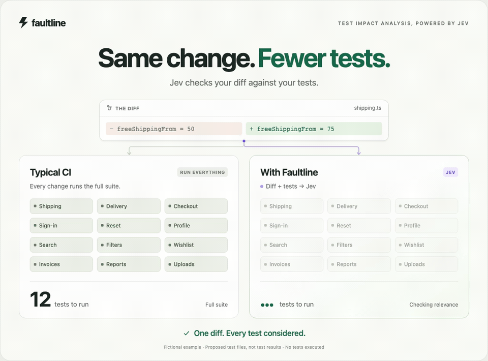

# Faultline

Faultline uses Jev to propose which tests to run for a PR or MR. It compares the cumulative diff with actual test source, then reports the selection, its reasons, and inference costs.

The goal is to reduce CI work while retaining useful regression detection. Today, Faultline is **report-only by default**: your CI keeps running its tests while you evaluate what Faultline would have selected. Selective execution is not implemented yet.

[Watch the 8-second video](docs/demo/faultline-jev-tia.mp4) · [Try the interactive demo](docs/demo/README.md). The demo uses invented data.

## How it works

1. Configure where your tests live in `faultline.json`. Faultline reads their source at the exact Git revision, without starting the application.
2. Start with the cumulative diff. If the diff leaves behavior implicit, such as inherited behavior, an external patch, or a dependency update, your agent gathers focused source evidence. Faultline verifies and freezes it.
3. Jev scores every readable configured test file. Faultline batches the work, keeps valid answers, and reports incomplete assessments explicitly.
4. Compare RUN/OMIT proposals at different relevance thresholds, then check them against existing CI outcomes.

The source interface works across languages and text-based test frameworks. There is no generated description catalog or separate code graph to maintain. The agent skill and Python CLI use the same engine; CI can reuse frozen context without an agent session.

Required tests and uncertain assessments stay RUN. Relevance is not a failure probability or a guarantee of preserved coverage. A smaller selection only becomes useful evidence once you check what it detects and misses.

## Get started

Follow [installation and setup](docs/install.md), then ask your agent:

> Use Faultline to benchmark this PR. Start with the diff and collect only missing implementation evidence. Show the expected Jev work and keep total Jev usage below $0.90, including retries. Save a report with 10%, 25%, and 50% relevance comparisons. Do not run tests or change CI.

- [Architecture](docs/architecture.md): what runs where and what gets stored.
- [Commands](docs/commands.md): prepare, score, recover, and report.
- [Validation plan](PLAN.md): what remains before selective CI execution.
- [Anonymized comparison](docs/evaluation/selector-comparison.md): the earlier evidence behind the Jev-only direction.
- [Performance milestone](docs/evaluation/jev-performance.md): fresh-call experiments, measured costs, and what is still experimental.
