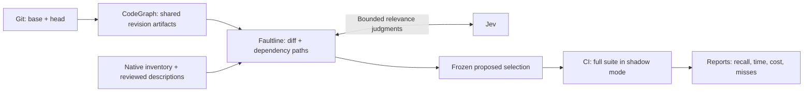

# Faultline

**Faultline is a test impact analysis experiment for CI and coding agents. It combines CodeGraph's structural relationships with Jev's semantic relevance judgments to identify which tests a change may affect.**

The goal is to reduce CI work while preserving regression detection across languages, frameworks, and monorepos. Faultline starts with full-suite shadow runs so its proposed selections can be assessed before teams enable skipping.

## Why this exists

Large suites spend time testing behavior that a change may not affect. File paths, dependencies, and measured coverage provide useful evidence, but related behavior can cross those boundaries. Faultline investigates whether semantic judgments add useful information to those existing signals.

The objective needs measurement: semantic relevance, observed regression recall, and measured code coverage are different things. Faultline does not promise that semantic selection preserves all coverage or catches every regression.

## Shared understanding, native evidence

Test descriptions live with the code and are reviewed when tests change. A coding agent can help create or improve those descriptions; teammates and CI reuse them through Git. A production change can affect whether a test should run without requiring its description to be rewritten.

CodeGraph builds a local, reusable graph of source relationships at the change’s base and head revisions. Teammates and CI can share these artifacts instead of repeatedly asking an agent to index the same code. Existing runner tools establish executable identities and produce results or optional coverage. Narrow integrations translate those outputs into common contracts. Faultline keeps its decisions language agnostic while preserving each runner's datasets, scenarios, variants, and setup requirements.

## Jev's role

Jev receives bounded change context, test descriptions, and graph evidence, then judges relevance on a fixed five-level scale. Faultline retains the probability distribution and calculates deterministic scores. Relevance is not a calibrated probability that a test will fail.

The intended selection policy combines those judgments with mandatory execution rules: changed tests, positive dependency/coverage matches, and uncertain evidence all require execution. Missing evidence must widen execution. Jev complements the evidence provided by test tools.



## How we'll assess it

Compare full execution, simple dependency/path and lexical baselines, Jev, and the combined policy on the same changes. Freeze decisions before inspecting outcomes. Report failing-change recall, failing-test recall, execution savings, and inference/audit overhead separately; report coverage only where it is measured.

Start with one ordinary PR/MR at a time. Preserve incomplete runs, flakes, infrastructure failures, missing artifacts, and unknown outcomes in the evidence. Repeated attempts do not count as independent regressions. A single green run cannot show that omitted tests were unnecessary.

## Install and use

Faultline ships as one self-contained Agent Skill with native Codex and Claude Code plugin packaging. Install with the [Skills CLI](https://github.com/vercel-labs/skills):

```bash
npx skills add git@github.com:ronaldtebrake/faultline.git --skill faultline
```

Choose your agent when prompted. Python 3.10+ runs the bundled engine; no third-party Python packages are required. Structural indexing needs the pinned CodeGraph 1.6.0 CLI; native discovery needs the configured test runners and their dependencies. The optional Python package exposes the same `faultline` command for local and CI use without an agent session.

See the [setup guide](docs/install.md) for installation and [API-key configuration](docs/install.md#configure-the-jev-api-key). Selected change text, descriptions, and graph evidence are sent to Jev. Credentials, cached predictions, and reports stay in ignored `.faultline/`; reviewed shared descriptions live in `faultline/catalog/`.

## Status

Implemented: revision-specific CodeGraph artifacts with incremental reuse, Git-shared descriptions, native PHPUnit/Behat discovery, batched and cached Jev evaluation, frozen proposals, validated full-suite execution, native/generic outcome import, and Markdown/JSON shadow reports. Existing semantic ranking and retrospective reports remain available.

**All current runs execute full suites.** Proposed omissions are experimental measurements. Framework wiring and Gherkin relationships remain incomplete, and graph gaps produce visible execution fallbacks. Artifact producer trust is supplied by your CI storage permissions.

The [working TIA guide](docs/tia.md) explains setup and use. Tests include the actual pinned CodeGraph release against synthetic PHP fixtures; real-project regression recall and CI savings remain unproven. [PLAN.md](PLAN.md) tracks validation and future selective execution.
