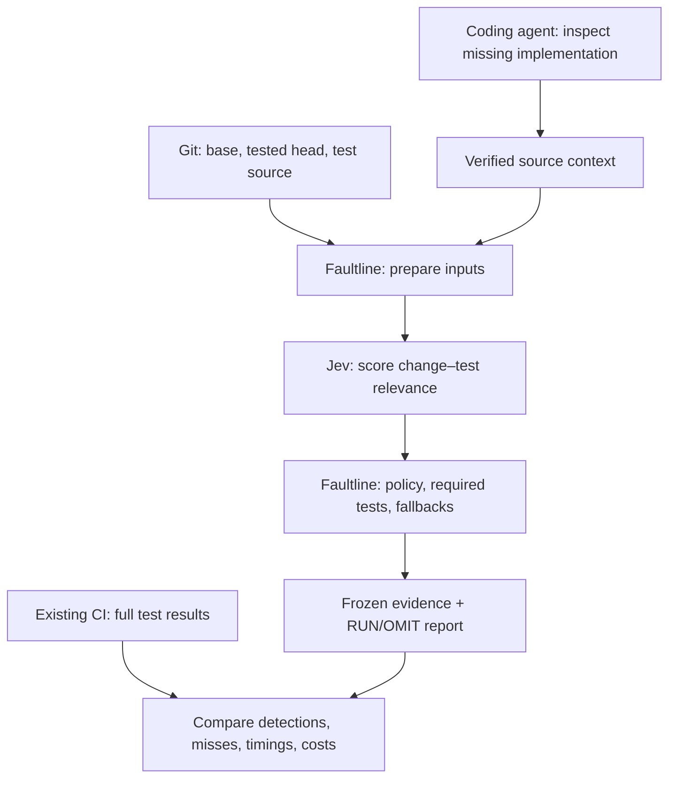

# Architecture

Faultline has one Python engine, distributed as a CLI and inside an agent skill. It uses Git for source snapshots and Jev for relevance scoring. Source analysis needs neither a running application nor a test runner.

## Responsibilities

| Component | Job |
| --- | --- |
| Coding agent | Configure test paths, resolve PR revisions, collect focused evidence when implementation is missing, explain results. |
| Git | Supply exact source at base/head without switching branches. |
| Faultline engine | Verify inputs, discover configured files, batch requests, validate answers, apply policies, save evidence and reports. |
| Jev | Return a five-level relevance distribution for each supplied change–test relationship. |
| Existing CI | Run tests and supply outcomes. Faultline does not schedule containers, services, or jobs. |

Start with the diff; ordinary source changes need no automatic context expansion. Collect external patch or dependency changes when their implementation is absent, with small integration excerpts only where needed. Prepare the combined inputs before spending; larger context can multiply requests.

The CLI does not automatically investigate callers or fetch dependency releases. An agent supplies that evidence through a pinned context bundle. Without a bundle, the benchmark uses the diff and test source alone. Both paths keep every configured test eligible.

## From evidence to a proposal

Each target is a complete test file in a suite and variant. Faultline prefers whole inputs; oversized pairs are split into explicit source/change windows. Every part needs a valid answer. Windowed scores use the strongest part relevance, so interactions across windows remain unassessed.

The saved omission rule requires `P(irrelevant) ≥ 95%`. Offline 10%, 25%, and 50% comparisons instead use `P(plausible + strong + direct)`, excluding weak relevance. These are different rules. Mandatory tests, shared-input changes, and incomplete evidence can override either rule.

Jev receives the selected change context and test source. It receives no later CI outcomes. Source verification checks authenticity, not whether the agent found every relevant connection. Reports keep relevance, observed regression recall, measured coverage, and savings separate.

## Shared and local data

Commit `faultline.json` with your project. Test source is already shared through Git; local configuration is recorded with each analysis, including historical ones.

Ignored `.faultline/` holds the API key, context bundles, frozen benchmarks, reports, and one SQLite answer cache. Cache reuse requires identical inference inputs, including the complete batch and model version. Missing token usage or agent costs remain unknown.

Shadow commands never run tests. Optional native discovery can load application code. Explicit `run --execute` currently validates and runs a full suite; selective execution remains future work. See the skill’s [execution reference](../skills/faultline/references/execution.md) for that separate workflow.
