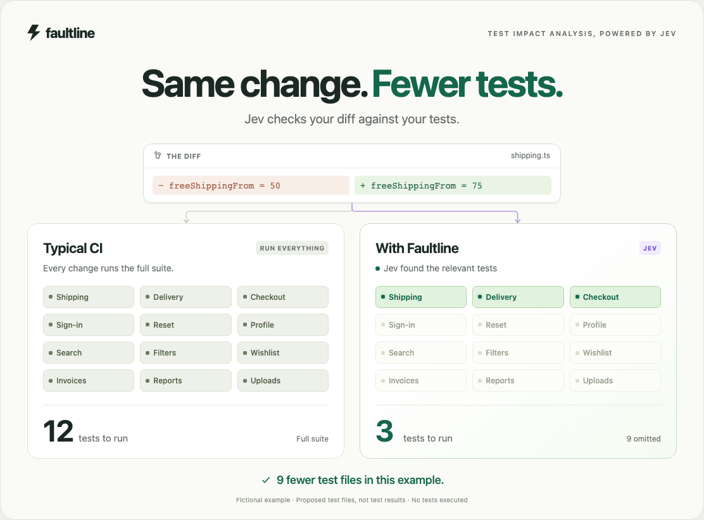

# Same change. Fewer tests.

A minimal interactive comparison: typical CI runs all 12 fictional tests; Faultline uses Jev to assess the diff against the tests and propose a smaller selection.

[Open the HTML demo](index.html) · [8-second video](faultline-jev-tia.mp4) · [Animated GIF](faultline-jev-tia.gif)

Open `index.html` in a browser. On GitHub, download the file first. It works offline without installation or API calls.

- Switch between **Shipping**, **Sign-in**, and **Search** to change the diff and proposed tests.
- Use **Replay** or **Play / Pause** to control the animation.
- For a looping screen capture, append `?capture=1&loop=1` to the HTML URL. This hides the controls. Add `&change=login` or `&change=search` for another example.
- The supplied MP4 shows the shipping example and is ready to share.

The inputs and selections are invented. Counts represent proposed test files, not execution time or measured savings. This demo illustrates the TIA flow; Faultline currently produces shadow reports, and this page executes no tests. Production policies also retain required tests and unresolved assessments, details intentionally omitted from this short illustration.

All HTML, CSS, and JavaScript are in `index.html`. No dependencies, fonts, or network requests. Autoplay and looping respect reduced-motion preferences. The `window.faultlineDemo` API exposes `seek(seconds)`, `setScenario(name, animate)`, `play()`, `pause()`, and `state()` for captures. Refresh the poster, video, and GIF when editing the demo.
